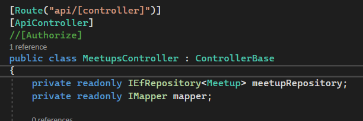
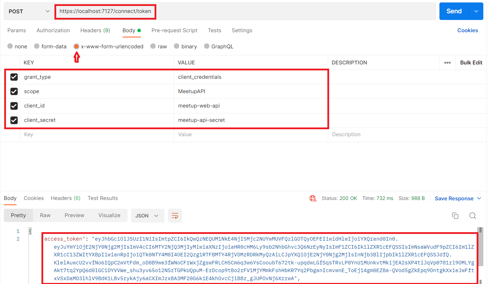
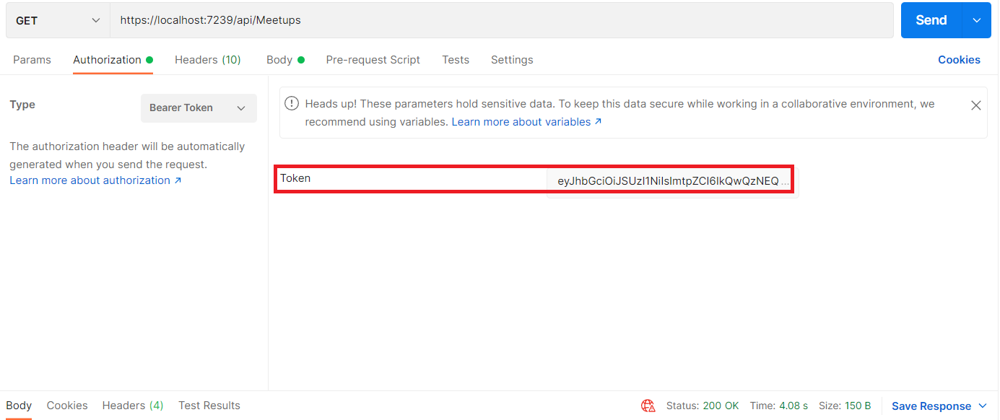

# MeetupAPI

##  Instruction

1. .NET 6.0 is required to run the project. 
2. For ease of checking CRUD operations, the "Authorize" attribute before the controller should be commented out.  
 
3. To check authorization, the "Authorize" attribute before the controller must be uncommented, and then two projects should be launched at once (IdentityServer и MeetupAPI). 
4. The access token is obtained using POSTMAN. 
 
5. With further use of HTTP methods, the received token must be indicated. 
 
